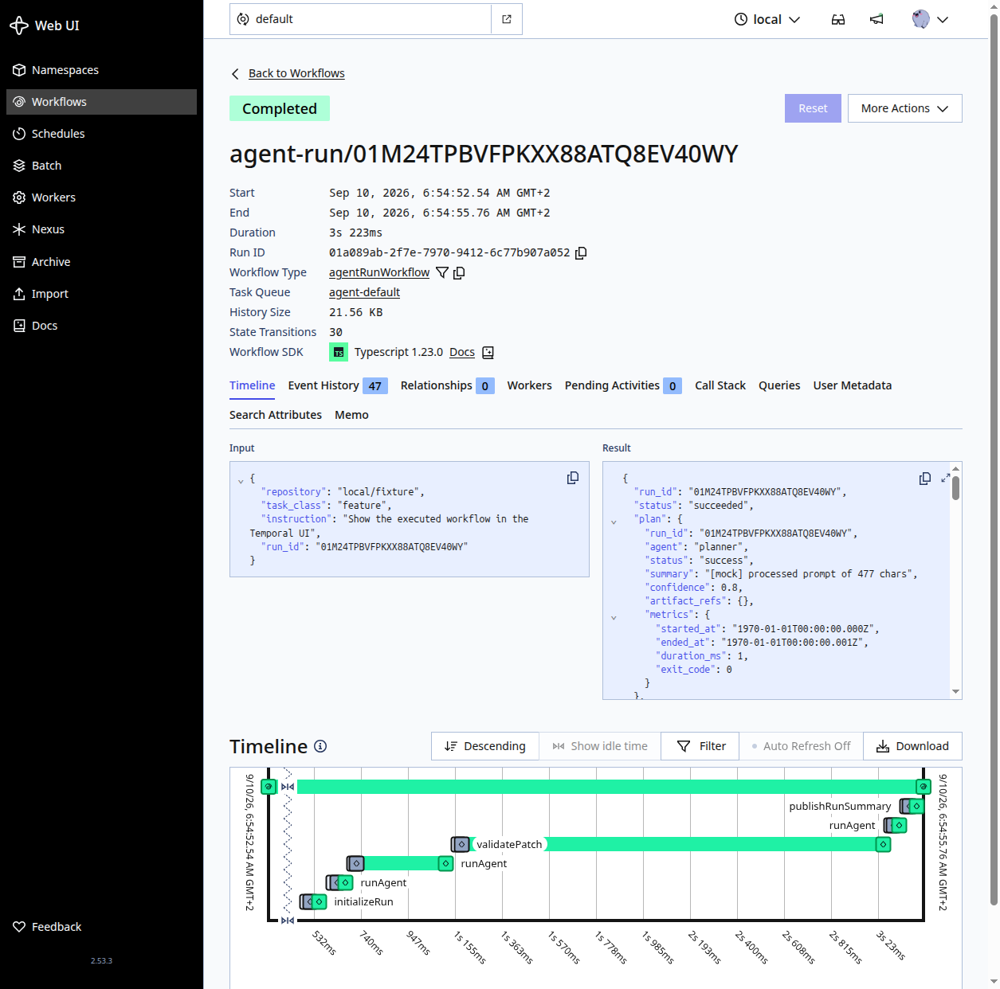

# Temporal Agentic Workflow

A proof of concept for running an agentic coding pipeline — **planner → coder →
deterministic validation → reviewer** — as a durable [Temporal](https://temporal.io)
workflow. Node workers orchestrate each step and invoke [`opencode run`](https://opencode.ai)
for the agent turns; a deterministic gate (patch apply, format, lint, test, secret scan)
sits between the coder and the reviewer so the review can never override a failed check.

Temporal owns the run's durable state and execution semantics — a run survives a worker
crash and resumes without re-executing completed steps. Only compact state (summaries,
`artifact://` references) crosses into workflow history; full patches, logs, and model
output live in an S3-compatible artifact store (MinIO locally).



*An `agentRunWorkflow` execution viewed in the Temporal Web UI: `initializeRun → runAgent
(planner) → runAgent(coder) → validatePatch → runAgent(reviewer) → publishRunSummary`.*

## Status

PoC. Phases 0–6 of [`docs/PLAN.md`](docs/PLAN.md) are implemented, including 5 failure-mode
demonstrations and a full observability pass in the Temporal Web UI — see
[`docs/evidence/`](docs/evidence/) for captured runs, histories, and screenshots.
No PRs, target-repository writes, or deployments are performed by this workflow.

## Architecture at a glance

```
POST /runs ──▶ agentRunWorkflow (Temporal)
                 │
                 ├─ initializeRun          (agent-default queue)
                 ├─ runAgent(planner)      (agent-default queue, real `opencode run`)
                 ├─ runAgent(coder)        (agent-default queue, real `opencode run`)
                 ├─ validatePatch          (tool-validation queue: apply → allowlist →
                 │                          format → lint → test → secret-scan)
                 ├─ runAgent(reviewer)     (agent-default queue, real `opencode run`)
                 └─ publishRunSummary      (agent-default queue, presigned artifact URLs)
```

The workflow decides the run outcome from `validatePatch`'s result — the reviewer's
commentary is captured but can never flip a failed deterministic gate to a pass.

## Repository layout

| Path | Purpose |
|---|---|
| `apps/run-api` | Fastify API: `POST /runs`, `GET /runs/:id`, `POST /runs/:id/cancel` |
| `packages/workflows` | The Temporal workflow definition, activity options, queries |
| `packages/worker` | Node workers (`agent-default`, `tool-validation`), activities, payload codec |
| `packages/agent-runtime` | `opencode` adapter, prompt composer, result normalizer, mock/real modes |
| `packages/agent-contracts` | Zod contracts (`TaskRequest`, `AgentResult`, `ValidationResult`, ...) |
| `packages/agent-tools` | Ephemeral workspace, patch apply, allowlist, format/lint/test, secret scan |
| `packages/artifact-store` | S3/MinIO client + `artifact://` URI helpers |
| `prompts` | Role prompts (planner, coder, reviewer) |
| `infra/temporal` | Local Temporal stack (Docker Compose): Postgres, Temporal, UI, MinIO |
| `schemas` | Generated JSON Schemas (from the Zod contracts, drift-checked) |
| `fixtures/sample-repo` | Fixture repo the coder role edits during validation |
| `docs/PLAN.md` / `docs/INITIAL.md` | The implementation plan and original brief |
| `docs/evidence` | Captured run output, workflow histories, and UI screenshots |

## Prerequisites

- Node.js ≥ 24, [pnpm](https://pnpm.io) 12.x
- Docker + Docker Compose (for the local Temporal/Postgres/MinIO stack)
- [`opencode`](https://opencode.ai) CLI on `PATH`, authenticated, for real-model runs
  (mock mode needs none of this — see below)

## Quick start

```bash
make install   # pnpm install
make build     # compile all packages
make up        # bring up Temporal + Postgres + MinIO, register search attributes
make worker    # run the agent-default worker      (separate terminal)
make worker-val  # run the tool-validation worker   (separate terminal)
make api       # run the Run API on :3300            (separate terminal)
```

Start a run:

```bash
curl -X POST localhost:3300/runs -H 'content-type: application/json' -d '{
  "repository": "local/fixture",
  "task_class": "feature",
  "instruction": "Add a farewell function next to greet()"
}'
```

Poll it:

```bash
curl localhost:3300/runs/<run_id>
```

Watch it in the Temporal Web UI at [localhost:8233](http://localhost:8233).

By default `AGENT_MODE=mock`, so no real `opencode` calls or spend happen — every role
returns a deterministic fixture. Set `AGENT_MODE=real` (and ensure `opencode` is
authenticated) to exercise real model calls end to end.

## Development

See [`AGENTS.md`](AGENTS.md) for the full command reference, environment variables, and
contribution conventions.

## Documentation

- [`docs/INITIAL.md`](docs/INITIAL.md) — the original PoC brief
- [`docs/PLAN.md`](docs/PLAN.md) — the phased implementation plan with acceptance evidence
- [`docs/evidence/`](docs/evidence/) — captured failure-mode runs, workflow histories, and
  Temporal UI screenshots proving the plan's definition-of-done criteria
